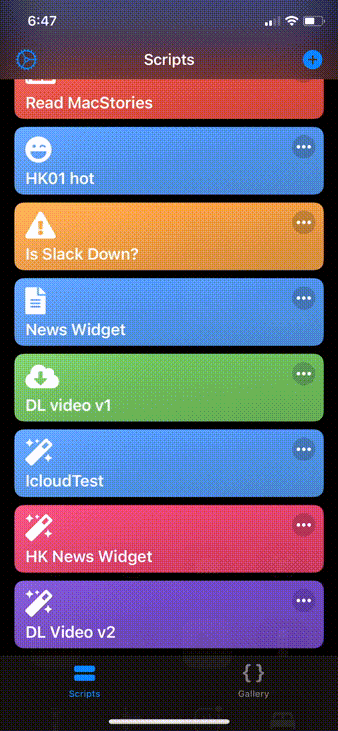
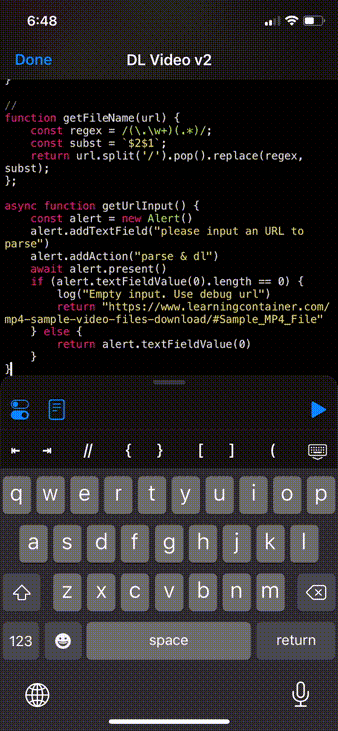
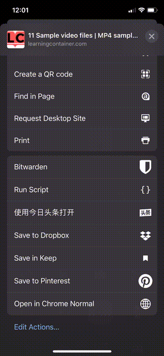

# Download video from browser with ios-Scriptable

## Objective
Enabling iOS user download MP4 video from a webpage with `<video/>` tag.

## Installation
1. Install Scriptable app from [iOS App Store](https://apps.apple.com/us/app/scriptable/id1405459188).
2. Go to app Settings > File Bookmarks
3. Click `+` button to select an iCloud folder as download destination. The bookmark name should be `scriptable-dowloadvideo`
4. Click `+` button from the app.
5. Copy & paste the [DownloadVideo.js](DownloadVideo.js) code to the editor.
6. Give an name (e.g. `DL Video`) and icon for the script,
7. Click `Share Sheet Inputs` and select `URLs`

## How to test
1. Click the play button in edit mode.
2. It will prompt a panel and show the logs. 
3. Test should be passed in case it shows `> saved to ... sample-mp4-file?_=1.mp4` on last line. 

## Use with action extenstion
1. Ensure above `Share Sheet Inputs` setting correct.
2. Go to a webpage ([Sample](https://www.learningcontainer.com/mp4-sample-video-files-download/#Sample_MP4_File)) with iOS Safari/Chrome.
3. Click the share button 
4. Click `Run Script` and click the script named above (e.g. `DL Video`)
5. Go to the iCloud drive and check. 

## Use with Home Screen
1. Open Scriptable and click the `...` button on this script
2. Click bottom left configuration button. 
3. Click `Add to Home Screen` and follow the insturction
4. Click the Home Screen icon to launch the script
5. Paste the URL to download video and click the confirm button

## Limitations
1. Not working on streaming like YouTube, Netflix .etc
2. Not working on HTML page render by JavaScript like imgur, giphy .etc
3. Use via action extension might be crash due to iOS memory usage control.  It could be resolve by either running this script directly from scritable app or via homescreen shortcut.

## How does it work
1. Opens the given URL with Webview and grab `<video src>` or `<video><source>` URLs
2. use `Request` to download URLs asynchronously 
3. save to iCloud drive via the Scriptable bookmark.